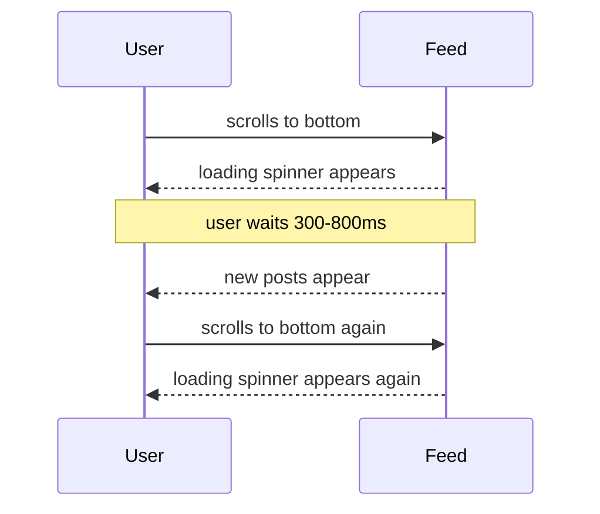
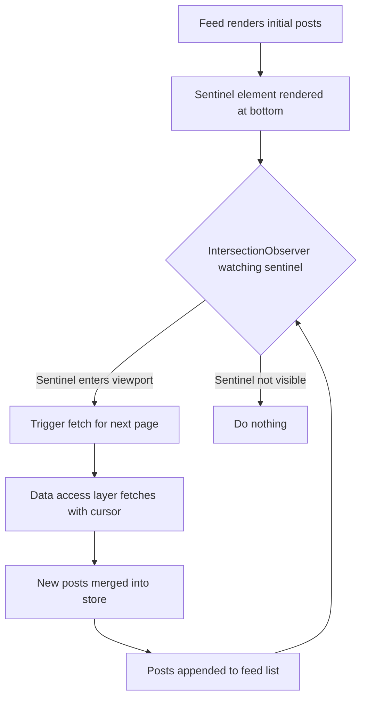
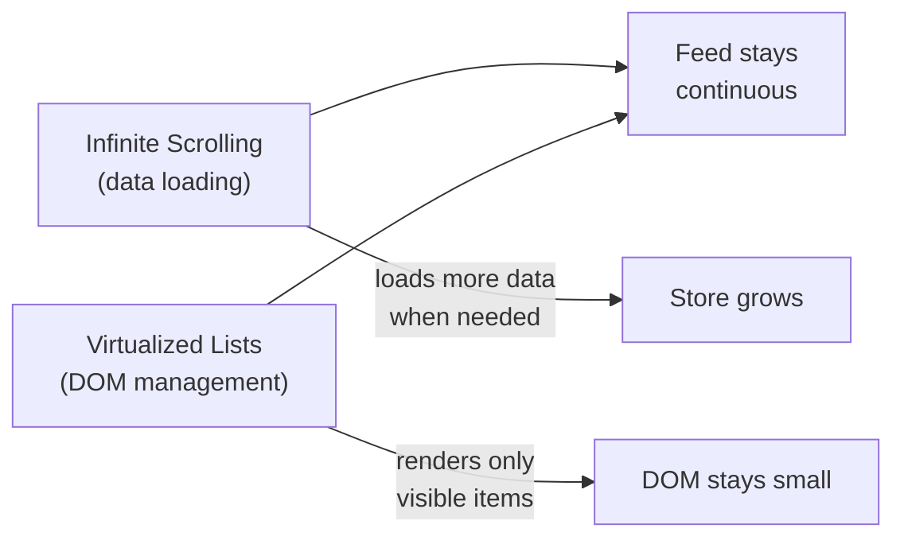

# Infinite Scrolling

#concept #performance #to-revise Back to: [[FE System Design MOC]] Used in: [[Performance Optimization]], [[Case Study - Facebook News Feed]] Related: [[Virtualized Lists]], [[Intersection Observer API]], [[Cursor-based Pagination]]

---

## What is infinite scrolling?

Infinite scrolling is a UX pattern where content loads automatically as the user scrolls toward the end of the currently loaded list — instead of using numbered pages ("Page 1, Page 2…"). The user never needs to click "Next Page".

Used by: Facebook, Twitter/X, Instagram, LinkedIn, Reddit, TikTok, YouTube.

---

## The core problem it solves

Traditional pagination forces users to make a conscious decision to load more content. For feeds and streams, this interrupts the browsing flow. Infinite scroll makes the experience feel seamless and continuous.

**But it introduces its own problem:** if implemented naively, the user sees a loading indicator and has to wait every time they hit the bottom of the loaded content.



**The fix: prefetch before the user hits the bottom.** Trigger the next fetch when the user is still ~1 viewport height away from the end — so new content is ready before they need it.

---

## Architecture of infinite scrolling



---

## Implementation approach 1 — scroll event (avoid)

```typescript
function handleScroll() {
  const sentinel = sentinelRef.current;
  if (!sentinel) return;

  const rect = sentinel.getBoundingClientRect();
  const triggerDistance = window.innerHeight; // 1 viewport height

  if (rect.top < triggerDistance) {
    fetchNextPage();
  }
}

// Throttle to avoid calling on every pixel
window.addEventListener('scroll', throttle(handleScroll, 150));
```

**Problems with this approach:**

- `getBoundingClientRect()` forces a **synchronous layout recalculation** — it reads layout properties that may be "dirty" and forces the browser to flush pending layouts. Called on every scroll event, this causes **layout thrashing**.
- Scroll event listeners run on the **main thread** — they compete with rendering, animations, and user interactions
- Even throttled, this adds measurable jank, especially on mobile

---

## Implementation approach 2 — Intersection Observer (preferred)

The `IntersectionObserver` API lets you register a callback that fires when a target element enters or exits the viewport (or another element). The browser handles the intersection checking internally — **off the main thread**, batched and optimized.

```typescript
// 1. Create the observer
const observer = new IntersectionObserver(
  (entries) => {
    const [entry] = entries;
    if (entry.isIntersecting && hasNextPage && !isFetchingNextPage) {
      fetchNextPage();
    }
  },
  {
    root: null,           // observe relative to viewport
    rootMargin: '0px 0px 100% 0px', // trigger 1 viewport height before sentinel enters
    threshold: 0,         // fire as soon as any part of sentinel is visible
  }
);

// 2. Observe the sentinel element
const sentinelRef = useCallback((node: HTMLDivElement | null) => {
  if (node) observer.observe(node);
  return () => observer.disconnect();
}, [hasNextPage, isFetchingNextPage]);

// 3. Render the sentinel at the bottom of the list
return (
  <div>
    {posts.map(post => <FeedPost key={post.id} post={post} />)}
    {hasNextPage && <div ref={sentinelRef} style={{ height: 1 }} />}
  </div>
);
```

> 💡 **`rootMargin: '0px 0px 100% 0px'`** means the observer fires when the sentinel is within **one viewport height** of the bottom of the viewport — the fetch starts well before the user hits the end.

---

## Full React implementation with TanStack Query

```tsx
import { useInfiniteQuery } from '@tanstack/react-query';
import { useEffect, useRef, useCallback } from 'react';

function InfiniteFeed() {
  const sentinelRef = useRef<HTMLDivElement>(null);

  const {
    data,
    fetchNextPage,
    hasNextPage,
    isFetchingNextPage,
    isLoading,
  } = useInfiniteQuery({
    queryKey: ['feed'],
    queryFn: ({ pageParam }) =>
      fetch(`/api/feed?cursor=${pageParam ?? ''}&count=20`).then(r => r.json()),
    getNextPageParam: (lastPage) => lastPage.nextCursor ?? undefined,
    initialPageParam: null,
  });

  // Set up IntersectionObserver on the sentinel
  useEffect(() => {
    const sentinel = sentinelRef.current;
    if (!sentinel) return;

    const observer = new IntersectionObserver(
      ([entry]) => {
        if (entry.isIntersecting && hasNextPage && !isFetchingNextPage) {
          fetchNextPage();
        }
      },
      { rootMargin: '0px 0px 100% 0px' } // prefetch 1vh before sentinel
    );

    observer.observe(sentinel);
    return () => observer.disconnect();
  }, [hasNextPage, isFetchingNextPage, fetchNextPage]);

  const posts = data?.pages.flatMap(page => page.posts) ?? [];

  if (isLoading) return <FeedSkeleton />;

  return (
    <div role="feed" aria-label="Home feed">
      {posts.map(post => (
        <FeedPost key={post.id} post={post} />
      ))}

      {/* Sentinel: IntersectionObserver watches this element */}
      {hasNextPage && (
        <div ref={sentinelRef} aria-hidden="true" style={{ height: 1 }} />
      )}

      {/* Loading indicator while fetching */}
      {isFetchingNextPage && <FeedSkeleton count={3} />}

      {/* End of feed */}
      {!hasNextPage && (
        <p style={{ textAlign: 'center', color: '#888' }}>
          You're all caught up!
        </p>
      )}
    </div>
  );
}
```

---

## Trigger distance and prefetch strategy

The `rootMargin` controls how early the fetch triggers. The tradeoff:

|rootMargin|Effect|
|---|---|
|`0px`|Triggers when sentinel enters viewport — user will see a loading state|
|`100% 0px` (1 viewport height)|Usually enough — content is ready before user reaches the end|
|`200% 0px` (2 viewport heights)|More aggressive — more wasted bandwidth if user doesn't scroll far|

**Dynamic trigger distance** (advanced): Adjust based on:

- **Network speed:** `navigator.connection.effectiveType` — on `slow-2g` or `2g`, fetch earlier. On fast networks, fetch closer to the boundary.
- **Scroll velocity:** If the user is scrolling very fast (tracked via `onScroll`), increase the trigger distance temporarily.

```typescript
function getTriggerDistance() {
  const connection = (navigator as any).connection;
  if (!connection) return '100%';

  switch (connection.effectiveType) {
    case 'slow-2g': return '300%';
    case '2g': return '200%';
    case '3g': return '150%';
    default: return '100%'; // 4g or wifi
  }
}
```

---

## Dynamic loading count

The `count` parameter in the feed API can be adapted based on viewport height:

```typescript
// In CSR: we know the viewport height before the first request
const count = Math.ceil(window.innerHeight / ESTIMATED_POST_HEIGHT) + 2; // +2 buffer

// In SSR: server doesn't know viewport → overfetch slightly
// Subsequent client-side fetches use the measured viewport
```

See: [[Cursor-based Pagination]]

---

## Loading states — what to show

### Option 1: Spinner (avoid for feeds)

```tsx
{isFetchingNextPage && <div className="spinner" />}
```

Problem: blank space above the spinner → the user can see the feed "ends" before new content arrives.

### Option 2: Skeleton placeholders (preferred)

```tsx
function FeedSkeleton({ count = 3 }) {
  return (
    <>
      {Array.from({ length: count }).map((_, i) => (
        <div key={i} className="post-skeleton" aria-hidden="true">
          <div className="skeleton-avatar" />
          <div className="skeleton-line" style={{ width: '60%' }} />
          <div className="skeleton-line" style={{ width: '90%' }} />
          <div className="skeleton-line" style={{ width: '75%' }} />
          <div className="skeleton-image" />
        </div>
      ))}
    </>
  );
}
```

**Why skeletons are better:**

- Preserve the expected layout — users can start scanning structure immediately
- Real content swaps in with minimal visual jump (lower perceived CLS)
- Facebook uses a shimmer animation layered on top of the skeleton shapes

---

## Connection to virtualized lists

Infinite scrolling and virtualization solve **different but related problems** — both are needed for production-scale feeds:



|Problem|Solution|
|---|---|
|Loading data progressively|Infinite scrolling (fetch-on-approach)|
|DOM growing unbounded|Virtualized list (render only visible items)|

Without virtualization, infinite scrolling eventually causes DOM bloat. Without infinite scrolling, you'd have to load everything upfront. Together they keep both data loading and DOM size efficient.

---

## Scroll position restoration

When a user navigates from the feed to a post detail page and presses Back, they expect to return to their exact scroll position.

**In SPAs** (where state persists): the store still has the feed data and scroll position → restore immediately from memory, no server round-trip.

```typescript
// Save scroll position when leaving the feed
const scrollPositionRef = useRef(0);
useEffect(() => {
  const container = scrollContainerRef.current;
  const handleScroll = () => {
    scrollPositionRef.current = container.scrollTop;
  };
  container.addEventListener('scroll', handleScroll, { passive: true });
  return () => container.removeEventListener('scroll', handleScroll);
}, []);

// Restore when returning
useEffect(() => {
  scrollContainerRef.current?.scrollTo(0, scrollPositionRef.current);
}, []);
```

For persistable scroll position (survives refreshes): store in `sessionStorage` or URL hash.

---

## Accessibility considerations

Infinite scrolling can be problematic for keyboard and screen reader users who navigate sequentially through the list — they may never reach the "trigger point" that loads more content.

**Solutions:**

- Provide a "Load more" button as a fallback for keyboard users
- Use `aria-live="polite"` to announce when new posts load: `"10 new posts loaded"`
- Ensure the sentinel trigger is reachable via Tab (or is invisible to tab order with `tabindex="-1"`)

```tsx
{/* Screen reader announcement when new posts load */}
<div aria-live="polite" aria-atomic="false" className="sr-only">
  {isFetchingNextPage ? 'Loading more posts...' : ''}
  {justLoaded ? `${newPostCount} new posts loaded` : ''}
</div>

{/* Keyboard-accessible fallback */}
{hasNextPage && !isFetchingNextPage && (
  <button onClick={() => fetchNextPage()} className="load-more-btn">
    Load more posts
  </button>
)}
```

See: [[Accessibility (A11y)]]

---

## Common mistakes to avoid

|Mistake|Problem|Fix|
|---|---|---|
|Using `scroll` + `getBoundingClientRect()`|Forces layout on every scroll|Use IntersectionObserver|
|Fetching on every scroll event (not throttled)|Dozens of simultaneous requests|Deduplicate: check `isFetchingNextPage` before triggering|
|Trigger at exactly the bottom (0px margin)|User always sees loading state|Trigger 1 viewport height early|
|Not handling the "end of feed" state|Infinite loading spinner forever|Check `hasNextPage` and show "You're all caught up"|
|Resetting the list on refetch|Scroll position lost, CLS|Append new pages to existing list (never replace)|
|Using offset pagination|Duplicate/missing items when feed updates|Use cursor-based pagination|

---

## Used in these case studies

- [[Case Study - Facebook News Feed]] — IntersectionObserver, prefetch, skeleton screens, dynamic count, scroll restoration
- Any case study with long dynamic lists: messaging history, search results, product grids, comment threads

---

## Key things to say in an interview

1. "I'd use an IntersectionObserver watching a sentinel element at the bottom — it triggers ~1 viewport height before the user reaches the end so they never see a loading state"
2. "Scroll event + `getBoundingClientRect()` forces a layout recalculation on every scroll tick — IntersectionObserver is browser-optimized and runs off the main thread"
3. "I pair infinite scrolling with a virtualized list — infinite scroll handles data loading, virtualization handles DOM size"
4. "For loading states I use skeleton placeholders rather than spinners — they preserve the layout and reduce perceived wait"
5. "I use cursor-based pagination, not offset — if new posts arrive while the user is scrolling, offsets shift and cause duplicates or gaps"