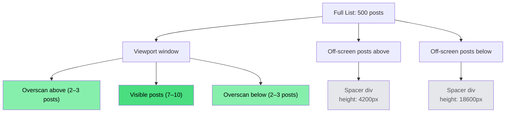
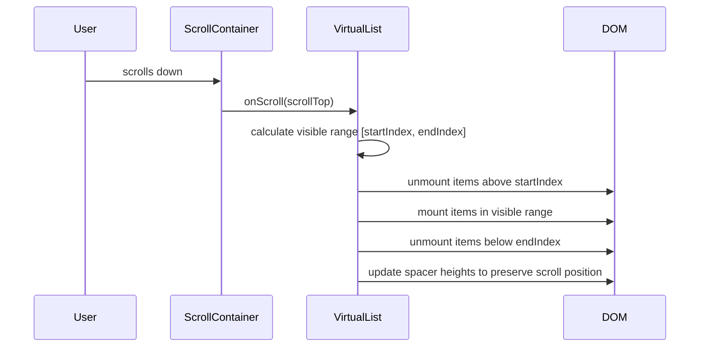

#concept #performance #to-revise Back to: [[FE System Design MOC]] Used in: [[Performance Optimization]], [[Case Study - Facebook News Feed]] Related: [[Infinite Scrolling]], [[Intersection Observer API]]

---

## The problem

In a long-lived SPA with infinite scrolling, every new post appended to the DOM stays in the DOM forever. Feed posts have complex DOM subtrees — avatar, author name, timestamp, body text, images, reaction buttons, comment previews. After a few hundred posts, you have:

- Thousands of DOM nodes actively in the document
- The browser must layout, paint, and composite all of them — even ones 5000px off-screen
- React (or any virtual DOM framework) must reconcile all of them on every state update
- Browser memory consumption grows unbounded

The result: sluggish scrolling, dropped frames, jank, and eventual tab crashes on mobile devices. Facebook and Twitter both hit this problem at scale.

---

## What is a virtualized list?

A virtualized list renders **only the items currently visible in the viewport, plus a small overscan buffer above and below**. Items outside this window are either:

1. **Not rendered at all** (simple approach)
2. **Replaced by spacer elements** whose height matches the measured height of the real content (Facebook's approach — preserves scroll position)



The scroll container sees the correct total height (spacers preserve it), but only a handful of real DOM subtrees exist at any given time.

---

## How it works — the mechanism

### 1. The scroll container

One outer `div` with `overflow-y: scroll` and a fixed height (usually `100vh`). This is the only element that scrolls.

### 2. The inner container (positional anchor)

An inner `div` whose `height` equals the **total estimated height of all items** — both rendered and virtual. This is what makes the scrollbar reflect the true list length.

```
Total height = sum of all item heights (measured or estimated)
```

### 3. Item positioning

Each rendered item is positioned absolutely within the inner container, at a `top` offset equal to the sum of all item heights above it.

```typescript
// Each item's top offset
const topOffset = items
  .slice(0, itemIndex)
  .reduce((sum, item) => sum + item.height, 0);
```

### 4. The render window

On every scroll event, recalculate which items fall within `[scrollTop - overscan, scrollTop + viewportHeight + overscan]` and render only those.



---

## Facebook's spacer div approach

Rather than fully unmounting off-screen items, Facebook replaces them with **lightweight spacer `<div>` elements** whose `height` matches the measured height of the real content.

```html
<!-- Off-screen post replaced by spacer -->
<div style="height: 312px" data-post-id="abc123" aria-hidden="true"></div>

<!-- On-screen post — full DOM subtree -->
<article role="article" aria-labelledby="author-abc">
  
  <div>John Doe · 2h ago</div>
  <p>Post content here...</p>
  <div class="reactions">...</div>
</article>
```

**Why spacers instead of full removal?**

- Scroll position is exactly preserved — no jumps
- The scrollbar thumb position remains accurate
- Screen readers can still understand the list structure (spacers are `aria-hidden`)
- The browser doesn't need to reflow the entire document when items mount/unmount

**Performance benefits:**

- **Browser painting:** fewer DOM nodes → fewer layout computations, less paint work
- **Virtual DOM reconciliation (React):** a spacer `<div>` is the simplest possible subtree — diffing it is near-zero cost vs diffing a 50-node post subtree

---

## Height measurement — the hard part

Virtualization requires knowing each item's height to calculate offsets and total container height. There are two cases:

### Fixed-height items (simple)

All items are the same height. No measurement needed — just calculate offsets arithmetically.

```typescript
const ITEM_HEIGHT = 120; // px

function getTopOffset(index: number) {
  return index * ITEM_HEIGHT;
}

const totalHeight = items.length * ITEM_HEIGHT;
```

### Variable-height items (feeds, chat, etc.)

Post heights vary because:

- Text wraps differently at different viewport widths
- Images load asynchronously and have unknown heights until loaded
- Some posts have videos, polls, link previews — all different heights

**The solution: measure and cache.**

```typescript
type HeightCache = Map<string, number>; // itemId → measured height px

// 1. Start with an estimated height for unmeasured items
const ESTIMATED_HEIGHT = 300;

// 2. After an item renders, measure its actual height
function onItemMounted(id: string, element: HTMLElement) {
  const measured = element.getBoundingClientRect().height;
  heightCache.set(id, measured);
  // Recompute total height and all offsets below this item
  recomputeOffsets(id);
}

// 3. When image loads and changes the item height, re-measure
imageElement.addEventListener('load', () => {
  const newHeight = postElement.getBoundingClientRect().height;
  if (newHeight !== heightCache.get(id)) {
    heightCache.set(id, newHeight);
    recomputeOffsets(id);
  }
});
```

**Important:** Always include `width` and `height` attributes on `` elements (or use CSS `aspect-ratio`). This lets the browser reserve space **before** the image loads — avoiding sudden height changes that break the measurement cache and cause CLS.

```html
<!-- Good: browser reserves 800×600 space before bytes arrive -->


<!-- Bad: height collapses to 0 until loaded, then jumps -->

```

---

## Implementation — React

### Using a library (recommended for production)

```bash
npm install @tanstack/react-virtual
```

```tsx
import { useVirtualizer } from '@tanstack/react-virtual';
import { useRef } from 'react';

function VirtualFeed({ posts }: { posts: Post[] }) {
  const parentRef = useRef<HTMLDivElement>(null);

  const virtualizer = useVirtualizer({
    count: posts.length,
    getScrollElement: () => parentRef.current,
    estimateSize: () => 300,        // estimated height before measurement
    overscan: 3,                     // render 3 extra items above and below
    measureElement: (el) => el.getBoundingClientRect().height,
  });

  return (
    <div ref={parentRef} style={{ height: '100vh', overflow: 'auto' }}>
      {/* Inner container — height = sum of all items */}
      <div style={{ height: virtualizer.getTotalSize(), position: 'relative' }}>
        {virtualizer.getVirtualItems().map((virtualItem) => (
          <div
            key={virtualItem.key}
            data-index={virtualItem.index}
            ref={virtualizer.measureElement}  // auto-measures on mount
            style={{
              position: 'absolute',
              top: 0,
              left: 0,
              width: '100%',
              transform: `translateY(${virtualItem.start}px)`,
            }}
          >
            <FeedPost post={posts[virtualItem.index]} />
          </div>
        ))}
      </div>
    </div>
  );
}
```

### From scratch (conceptual, for interviews)

```tsx
function SimpleVirtualList({ items, estimatedItemHeight = 300 }) {
  const containerRef = useRef(null);
  const [scrollTop, setScrollTop] = useState(0);
  const viewportHeight = window.innerHeight;
  const overscan = 3;

  // Find which items are in the visible window
  const startIndex = Math.max(
    0,
    Math.floor(scrollTop / estimatedItemHeight) - overscan
  );
  const endIndex = Math.min(
    items.length - 1,
    Math.ceil((scrollTop + viewportHeight) / estimatedItemHeight) + overscan
  );

  const visibleItems = items.slice(startIndex, endIndex + 1);
  const offsetAbove = startIndex * estimatedItemHeight;
  const offsetBelow = (items.length - endIndex - 1) * estimatedItemHeight;

  return (
    <div
      ref={containerRef}
      style={{ height: '100vh', overflow: 'auto' }}
      onScroll={(e) => setScrollTop(e.currentTarget.scrollTop)}
    >
      {/* Spacer above */}
      <div style={{ height: offsetAbove }} />

      {/* Visible items */}
      {visibleItems.map((item, i) => (
        <FeedPost key={item.id} post={item} />
      ))}

      {/* Spacer below */}
      <div style={{ height: offsetBelow }} />
    </div>
  );
}
```

---

## Overscan — how much buffer to render

Overscan is the number of extra items to render **above and below** the visible window. It prevents users from seeing blank space when scrolling fast.

|Overscan|Effect|
|---|---|
|Too small (0–1)|Users see blank space during fast scroll|
|Good (2–5)|Smooth scrolling, reasonable DOM size|
|Too large (10+)|Defeats the purpose — too many DOM nodes|

`react-virtual` defaults to 3. Facebook uses a dynamic overscan that increases when the user is scrolling fast.

---

## Tradeoffs — say these before the interviewer asks

### 1. Focus loss on unmount

When a focused element (e.g. an open reaction menu, a focused button) scrolls out of the overscan window, it gets unmounted. The browser moves focus to `<body>`, which is invisible and confusing for keyboard users.

**Solutions:**

- Keep recently focused items mounted regardless of scroll position (add them to a "pinned" set)
- Restore focus programmatically to the correct item when it remounts (`element.focus()`)
- Close any open menus when their post exits the overscan window

```typescript
// Track which post has an open menu
const [activePostId, setActivePostId] = useState<string | null>(null);

// Always include the active post in the render window
const extendedStart = activePostId
  ? Math.min(startIndex, getIndexById(activePostId))
  : startIndex;
```

### 2. Browser find-in-page (Ctrl/Cmd+F)

`Ctrl+F` only searches the DOM that is currently present. Off-screen posts are not in the DOM → their content is invisible to find-in-page.

**Mitigations:**

- Widen the overscan window when find-in-page is detected (listen for `keydown` on `Ctrl+F`/`Cmd+F`)
- Build an in-app search feature
- This is a known limitation — worth acknowledging in an interview, not necessarily solving

```typescript
useEffect(() => {
  function handleKeyDown(e: KeyboardEvent) {
    if ((e.ctrlKey || e.metaKey) && e.key === 'f') {
      setOverscan(50); // widen overscan when find-in-page is invoked
    }
  }
  document.addEventListener('keydown', handleKeyDown);
  return () => document.removeEventListener('keydown', handleKeyDown);
}, []);
```

---

## Performance impact summary

|Without virtualization|With virtualization|
|---|---|
|500 posts → 500 full DOM subtrees|500 posts → ~15 DOM subtrees|
|Layout recalculated for all 500 on scroll|Layout recalculated for ~15|
|React diffs entire list on state update|React diffs only visible items|
|Memory grows unbounded|Memory stays roughly constant|
|Scroll performance degrades over time|Scroll performance stays constant|

---

## Libraries

|Library|Notes|
|---|---|
|`@tanstack/react-virtual`|Most popular, supports variable heights, auto-measurement|
|`react-window`|Older, simpler, fixed or estimated heights|
|`react-virtualized`|Feature-rich but heavier; mostly superseded by react-virtual|
|Facebook's own|Custom implementation using spacer divs as described|

---

## Used in these case studies

- [[Case Study - Facebook News Feed]] — spacer div approach, variable heights, focus management
- Any case study with long lists: messages, search results, comments, product listings

---

## Key things to say in an interview

1. "I'd use a virtualized list to keep the DOM size constant regardless of how many posts the user scrolls through"
2. "Off-screen posts are replaced by spacer divs whose height matches the measured content — scroll position is preserved"
3. "Feed items have variable heights because text wraps and images load async, so I need a measurement cache and must recompute offsets when image dimensions become known"
4. "Two tradeoffs to name proactively: focus loss when a focused element unmounts, and find-in-page not searching off-screen content"