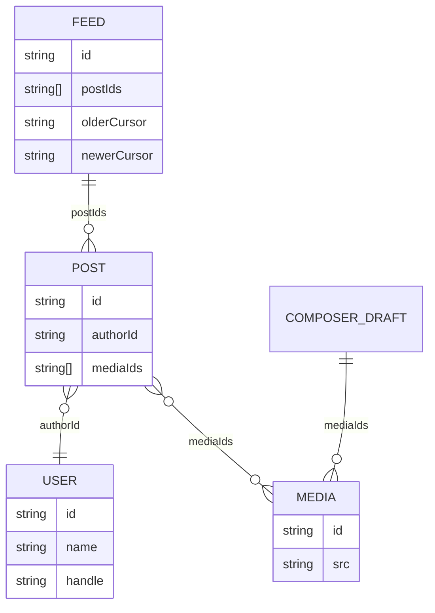
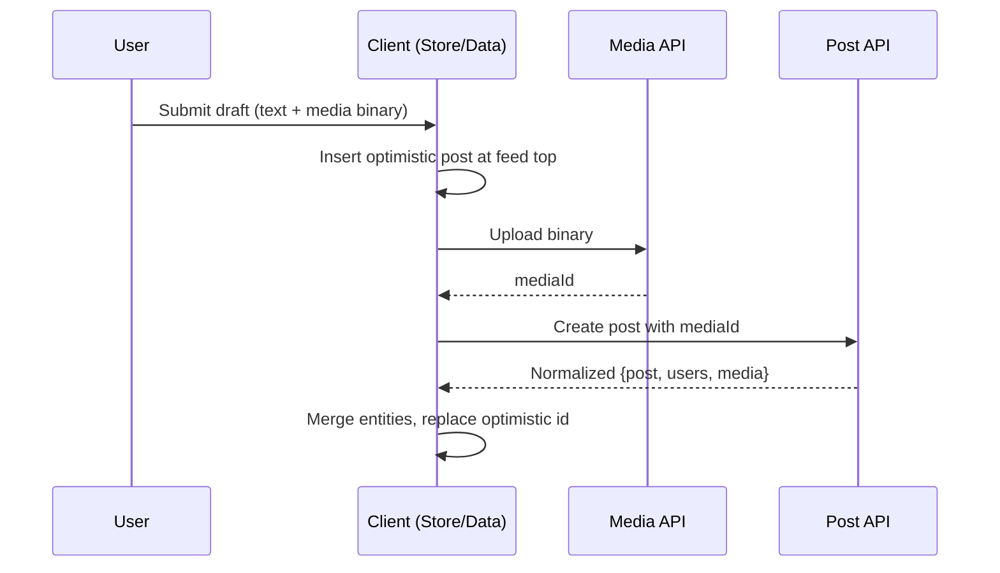
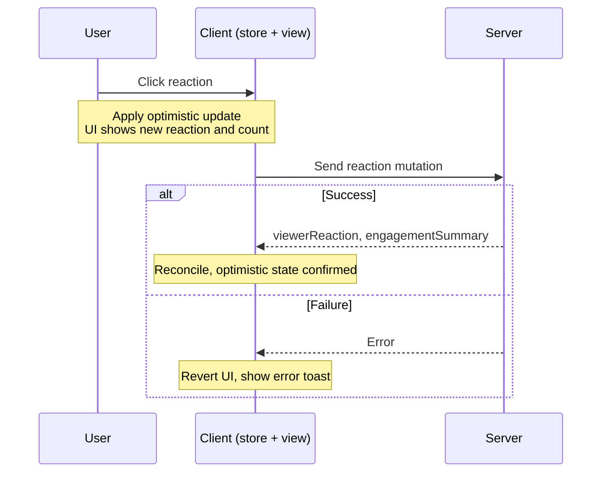

---

## The question

> Design a web news feed application that lets users browse a feed of posts, react to posts, and create new posts.

![[News Feed Example.png|416]]

Assume: primarily text and image posts. Focus on FE architecture and the client/server contract for loading, rendering, and updating the feed.

Real-life examples: Facebook, Twitter, Quora, Reddit.

> ⭐ ==Cover the core architecture first:==
> This question can go deep, but in interviews you should focus first on requirements, rendering and navigation defaults, state shape, and API shape. Only dive into pagination edge cases, virtualization, stale-session handling, or live updates if the interviewer asks for more depth.

---

## R — Requirements exploration

### Functional requirements (core scope)

- Browse news feed of posts by the user and their friends
- Like and react to feed posts
- Create and publish new posts (text + image)

### Out of scope (mention, don't design)

- Commenting, sharing, single post surface
- Feed ranking algorithm
- Ads delivery
- Full back-end fanout/pull architecture

### Non-functional requirements (clarify these)

- Render initial feed quickly, load more on scroll (infinite scroll)
- Handle long-lived sessions, stale data, feed performance
- Mobile experience is a nice-to-have; architecture stays web-first

### Clarifying questions to ask

- What post types? Text + image is enough to cover rendering, media loading, pagination, and mutations
- What pagination UX? Infinite scrolling — more posts added when user reaches end
- Mobile priority? Not a priority but a good mobile experience is desirable

---

## A — Architecture / High-level design

### Decision 1: Rendering approach

|Strategy|How it works|Pros|Cons|
|---|---|---|---|
|**SSR**|Server generates full HTML per request|Fast first paint, strong SEO|Server load, complexity|
|**CSR**|Server sends minimal shell + JS; browser renders|Great interactivity, long-session state|Slower first load, weaker SEO|
|**Hybrid**|SSR for initial page, CSR after hydration|Best of both|Most complex|

>✅ ==Default to CSR for the signed-in home feed==
The feed is personalized (SEO is irrelevant), highly interactive, and benefits from keeping state alive across a long session. SSR/hybrid is correct for public post pages, marketing surfaces, or logged-out experiences.

To keep LCP competitive in CSR: tight budgets on app-shell bytes, initial feed data, and critical JS. In practice, frameworks like [Next.js](https://nextjs.org/) and [TanStack Start](https://tanstack.com/start/latest) let products mix rendering strategies by route or surface when needed, which is how a product can keep the signed-in home feed on CSR while still serving public post permalinks with SSR.

### Decision 2: Navigation approach

|Model|What it does|Feed verdict|
|---|---|---|
|**SPA**|One load; JS updates URL + DOM without page reload|✅ Default for feed|
|**MPA**|Each route = separate HTML page + full reload|❌ Tears down state on every nav|

**SPA wins** because: post data already in the store → navigating to post detail feels instant. MPA discards cached entities, optimistic updates, composer drafts, and scroll position on every navigation.

### Architecture layers (4 layers)
![[News Feed Architecture Diagram.png|522]]

|Layer|Responsibility|Examples|
|---|---|---|
|**View**|What users interact with. Renders data from store, triggers actions. Handles local interaction state only.|React/Vue/Svelte components|
|**Store**|Source of truth for client-side state. Holds feed data, posts, users, composer state, optimistic updates, freshness state. Keeps UI consistent when network is slow.|Redux Toolkit, Zustand, Jotai|
|**Data access**|Abstracts server APIs. Handles fetching, caching policy, pagination, retries, normalization of raw API responses.|React Query (TanStack), tRPC, Relay, Apollo Client|
|**Server**|Black box. Exposes HTTP endpoints for feed, single post, post creation, media upload, reactions, shares.|—|

> 💡 In an SPA, Store and Data access layers initialize once on first load and persist throughout the session.

Read more in [Rendering on the web](https://web.dev/rendering-on-the-web/) and the ["Rebuilding our tech stack for the new Facebook.com" blog post](https://engineering.fb.com/2020/05/08/web/facebook-redesign/).

---

## D — Data model

> 💡 **Model for efficient rendering and frequent updates — not just mirroring raw API responses.** The feed is NOT a nested array of post objects. It is an ordered list of post IDs + pagination metadata.

### Post entity

```typescript
type PostBody = {
  text: string;
  entities: Array<{
    type: 'mention' | 'hashtag' | 'link';
    start: number;   // inclusive
    end: number;     // exclusive (half-open, matches String.prototype.slice)
    userId?: string;
    url?: string;
  }>;
};

type ReactionType = 'like' | 'love' | 'haha' | 'wow' | 'sad' | 'angry';

type EngagementSummary = {
  reactions: Record;
  totalReactions: number;
  commentCount: number;
  shareCount: number;
};

type Post = {
  id: string;
  authorId: string;           // reference — NOT nested User object
  body: PostBody;
  mediaIds: string[];         // reference — NOT nested Media objects
  engagementSummary: EngagementSummary;
  viewerReaction: ReactionType | null;
  viewerHasShared: boolean;
  createdAt: number;
};
```

### User entity

```typescript
type RelationshipToViewer = {
  isFriend?: boolean;
  isFollowing?: boolean;
  isMuted?: boolean;
  isBlocked?: boolean;
};

type User = {
  id: string;
  name: string;
  handle: string;
  profilePhotoUrl: string;
  isVerified: boolean;
  relationshipToViewer: RelationshipToViewer;
};
```

> 💡 User data is shared across many posts. Treat it as a **globally cached entity** — not duplicated inside each post. A profile update then reflects everywhere immediately.

### Feed entity

```typescript
type Feed = {
  id: string;
  postIds: string[];           // ordered list of IDs — not nested posts
  olderCursor: string | null;  // scroll down
  newerCursor: string | null;  // check for new posts
  hasOlder: boolean;
  hasNewer: boolean;
  lastFetchedAt: number | null;
};
```

### Media entity + Composer draft

```typescript
type Media = {
  id: string;
  src: string;
  previewSrc?: string;
  alt: string;
  width: number;   // include for aspect-ratio reservation (prevents CLS)
  height: number;
};

type ComposerDraft = {
  body: PostBody;
  mediaIds: string[];
  uploadState: 'idle' | 'uploading' | 'failed';
  submitState: 'idle' | 'submitting' | 'submitted' | 'failed';
};
```

### Normalized store

```typescript
type Store = {
  feedsById: Record<string, Feed>;
  postsById: Record<string, Post>;
  usersById: Record<string, User>;
  mediaById: Record<string, Media>;
  composerDraft: ComposerDraft;
};
```

#### Normalized client store entity relationships (Mermaid )



> ⭐ ==**Do not model the feed as a nested array of full post objects**==
> Denormalized (`NestedPost { id, author: User, media: Media[] }`) means one profile update requires finding and rewriting every embedded copy. Normalization means `usersById[id]` change reflects everywhere instantly.

_Further reading: [Making Instagram.com faster: Part 3, cache first](https://instagram-engineering.com/making-instagram-com-faster-part-3-cache-first-6f3f130b9669)_

---

## I — Interface definition (API)

### API boundaries

|Source|Destination|API type|Purpose|
|---|---|---|---|
|Server|Data access|HTTP|Return feed posts, single posts, mutation responses|
|Data access|Server|HTTP|Fetch feed, send writes (post creation, reactions, shares)|
|Data access|Store|JavaScript|Normalize responses, write cached entities + pagination state|
|Store|View|JavaScript|Provide rendered state (posts, reactions, drafts, freshness)|

> ℹ️ ==**Feed identity should come from the authenticated session**==
> A caller-supplied `userId` is not a safe source of truth. Trusting the session instead avoids security mistakes and unnecessary API differences based on who the caller claims to be.
### Fetch feed 

```
GET /feed
Params: { count: number, cursor?: string, direction?: 'older' | 'newer' }
Auth:   Session cookie (NOT caller-supplied userId — security risk)
```

> 💡 Use `direction: 'older'` for infinite scroll down, `direction: 'newer'` for background stale-check. `count` adapts based on `window.innerHeight` in CSR (server doesn't know viewport size so it overfetches slightly on SSR initial load).

#### Pagination: cursor-based vs offset-based

|                | Offset-based                                            | Cursor-based                              |
| -------------- | ------------------------------------------------------- | ----------------------------------------- |
| How            | `?offset=20&limit=10`                                   | `?cursor=<id>&limit=10`                   |
| Stability      | ❌ New posts shift offsets → duplicates or missing items | ✅ Stable — doesn't depend on dataset size |
| Large datasets | ❌ DB must skip increasing records                       | ✅ Efficient at any depth                  |
| Best for       | Static lists (search results, admin tables)             | Dynamic feeds                             |


> ✅ ==**For dynamic feeds, reach for cursor-based pagination by default**==
> Cursor also enables bidirectional navigation — scroll down for older (`olderCursor`), background-check for newer (`newerCursor`).

_Reference: [Evolving API Pagination at Slack](https://slack.engineering/evolving-api-pagination-at-slack)_

#### Dynamic loading count

The feed API exposes a `count` or `limit` parameter alongside the cursor. Use this to adapt how many posts to fetch based on the actual viewport height:

- **CSR flow:** Read `window.innerHeight` before the first request → size the initial page accurately
- **SSR flow:** Server doesn't know viewport height ahead of time → overfetch slightly on first load. Subsequent fetches adapt based on measured viewport height.


#### HTTP caching, deduplication, and idempotency

- Feed + single-post responses: short-lived `Cache-Control` headers + `ETag` → cheap `304 Not Modified` revalidation. `stale-while-revalidate` lets client paint cached data while background fetch refreshes.
- **In-flight deduplication:** Data access layer coalesces identical in-flight requests and cancels superseded ones via `AbortController`. TanStack Query and Relay do this by default.
- **Idempotency keys:** Generate a UUID on the client **at submit time** (not at request-fire time) and attach it to every mutating request (`Idempotency-Key` header or request body). Server treats duplicate keys as the same write — no duplicate posts from retries.

> ✅ **==Attach an idempotency key at submit time for every mutating request==**
> Generate the idempotency key **when the user submits**, not when the request fires. This ensures retries by the client, Service Worker, or network proxy all carry the original key.


### Other endpoints

| Endpoint                          | Purpose                                                                                       |
| --------------------------------- | --------------------------------------------------------------------------------------------- |
| `GET /posts/{postId}`             | Fetch single post for detail/permalink page                                                   |
| `PUT /posts/{postId}/reaction`    | Set or change viewer's reaction                                                               |
| `DELETE /posts/{postId}/reaction` | Remove viewer's reaction                                                                      |
| `POST /posts`                     | Create new post — body: `{ body: PostBody, mediaIds: string[] }`                              |
| `POST /media/uploads`             | Upload media binary first → returns `mediaId` or presigned URL for direct blob storage upload |

### Post Creation flow

**Media upload first (if attachments exist):**
1. `POST /media/uploads` → receive `mediaId` (or presigned URL for direct blob upload)
2. `POST /posts` with `{ body: PostBody, mediaIds: [mediaId] }`

> ✅ **==Upload media binaries first, then create the post by `mediaId`==**
> In production, the upload endpoint returns a presigned URL so the client uploads directly to blob storage — keeping large binaries off the application server and letting post creation stay a small JSON request.

For simplicity, we'll assume attachments are directly uploaded to the app server and a `mediaId` is returned.

**Response shape:**
```json
{
  "post": {
    "id": "124",
    "authorId": "456",
    "body": { "text": "Hello world", "entities": [] },
    "mediaIds": ["m_1"],
    "engagementSummary": {
      "reactions": { "like": 20, "haha": 15 },
      "totalReactions": 35,
      "commentCount": 0,
      "shareCount": 0
    },
    "viewerReaction": null,
    "viewerHasShared": false,
    "createdAt": 1620639583
  },
  "users": [{ "id": "456", "name": "John Doe" }],
  "media": [
    {
      "id": "m_1",
      "src": "https://www.example.com/feed-images.jpg",
      "alt": "An image alt",
      "width": 1200,
      "height": 800
    }
  ]
}
```

**Client after receiving response:**
- Merge `users` into `usersById`
- Merge `media` into `mediaById`
- Prepend new `post.id` to `feed.postIds`
- If using optimistic UI: insert temporary local post immediately → reconcile with canonical server `id` on success

#### Post creation flow with media upload and optimistic UI (Mermaid Diagram)




---

## O — Optimizations and deep dive

> ⭐ **==This section is intentionally deeper than the minimum interview answer==**
> In most interviews, cover the core architecture first and use these optimizations only as follow-up depth when the interviewer asks you to go further.

### O1 — Feed list

#### Virtualized lists

**Problem:** Infinite scroll appends posts to the DOM indefinitely. Feed posts have complex DOM structure. Long-lived SPAs accumulate hundreds of posts → DOM bloat, layout thrashing, browser memory issues.

**Solution:** Render only posts in viewport + small overscan window. Off-screen posts replaced with spacer `<div>` whose `height` matches the measured post height — scroll position preserved, heavy subtree removed.

Benefits:

- Fewer DOM nodes → faster browser painting
- Simpler virtual DOM diffing (React) → smaller real DOM mutations

Facebook and Twitter both use virtualized lists.

**Virtualization tradeoffs to name proactively:**

- Focused element scrolled out of viewport gets unmounted → loses focus.
	***Fix:*** keep recently focused items mounted OR restore focus programmatically on remount.
- `Ctrl/Cmd+F` find-in-page only searches present DOM. 
	***Fix:*** widen overscan when find-in-page is invoked via a keydown hint, or offer in-app search.

#### Infinite scrolling — implementation

Render a sentinel element at the bottom of the feed and detect when it enters the viewport.

| Approach | How | Verdict |
|---|---|---|
| `scroll` event listener | Throttled listener + `Element.getBoundingClientRect()` | ❌ Runs synchronously, forces layout on every scroll |
| **Intersection Observer API** | Browser callback when sentinel enters viewport | ✅ Preferred — browser-batched, no layout forcing |

> ✅ ==**Prefer Intersection Observer over scroll + `getBoundingClientRect()`**==
> Use it for infinite-scroll triggers and prefetch boundaries. Scroll handlers run synchronously and `getBoundingClientRect()` can force layout; Intersection Observer lets the browser batch visibility checks and deliver callbacks without your code polling layout on every scroll.

**Trigger distance:** ~1 viewport height — wide enough to load before the user hits the bottom, narrow enough to avoid wasted fetches. Can be made dynamic based on network speed and scroll velocity.

The same IO instance can double as a **prefetch boundary**, so users rarely see a loading state at all.

see more: [[Infinite Scrolling]]

#### Loading indicators

- **Avoid** a single spinner — doesn't preserve layout
- **Use** skeleton placeholders matching post structure → users scan layout immediately, real content swaps in with minimal visual jump
- A shimmer animation can layer on top of the skeleton
see more:  [shimmer loading effect](https://docs.flutter.dev/cookbook/effects/shimmer-loading)

#### Scroll position restoration

Cache feed data + scroll position in the client store. When user navigates to post detail and returns:

- Feed entities already in store → no server round-trip
- Previous scroll position restored instantly — feels near-instantaneous

This is a major SPA advantage over MPA navigation.

#### Stale feeds

Three approaches when `lastFetchedAt` is old:

1. **Force full refresh + scroll to top** (what Facebook does after a duration)
2. **Silently prepend new posts** — ❌ disrupts user's reading position
3. **"New posts available" banner** ✅ — preserves reading position, user controls when to merge

> ℹ️ **==Avoid silently prepending new posts while the user is reading==**
> A banner such as "New posts available" is usually safer because it preserves reading position and lets the user choose when to merge newer content.

**Beyond time-based staleness:**

- **Server-driven invalidation:** server pushes a version/high-water-mark over the live-update channel. Viral posts or deleted posts reflect immediately without waiting for a refresh check.
- **Cross-tab invalidation:** User with two tabs — reacting in one leaves the other stale. Fix: `BroadcastChannel` that Data access layer writes to on every canonical entity mutation. Peer tabs subscribe and re-read the affected record. With IndexedDB-backed store, `Web Locks API` can elect a leader tab to own long-lived socket or polling state.

> ℹ️ **==Pair optimistic updates with a cross-tab invalidation signal==**
> Shared storage alone does not notify other tabs of changes. Without a `BroadcastChannel` or equivalent, a reaction applied in one tab will sit stale in another tab until the user interacts with it.

---

### O2 — Feed post optimizations

#### Delivering data-driven dependencies only when needed (Facebook's approach)

**Problem:** Facebook feed supports 50+ post formats. Loading all renderers upfront = massive unused JS.

**Solution:** Facebook fetches data from the server using [Relay](https://relay.dev/), which is a JavaScript-based GraphQL client. Relay couples React components with GraphQL to allow React components to declare exactly which data fields are needed, and Relay will fetch them via GraphQL and provide the components with data. Relay has a feature called [data-driven dependencies](https://relay.dev/docs/glossary/#match) via the `@match` and `@module` GraphQL directives. The GraphQL payload can include metadata describing which renderer module matches the returned data, and the client then loads that module dynamically.

```graphql
# Sample GraphQL query to demonstrate data-driven dependencies.
... on Post {
  content @match {
    ...TextPostFragment @module(name: "TextComponent.react")
    ...ImagePostFragment @module(name: "ImageComponent.react")
  }
}

```

The `@match` directive on the `content` field tells Relay that the selection is type-conditional, and each fragment spread is paired with `@module(name: ...)` to declare which component renders that type. At query time, the server selects the matching data branch and returns module metadata alongside the GraphQL payload. The client still loads the matching JavaScript module dynamically, but only for the renderer that is actually needed.

This idea applies to: hover cards, richer composer tools, interaction-heavy widgets — anything interaction-heavy that isn't needed on first paint.

**Caveat:** Dynamic renderer chunks can create a data-then-code waterfall. Common above-the-fold renderers should be part of **Tier 2** loading or prefetched once the initial feed payload makes their need likely — so the first visible posts don't wait on a second round-trip.

_Source: [Rebuilding our tech stack for the new Facebook.com](https://engineering.fb.com/2020/05/08/web/facebook-redesign/)_

#### Rendering mentions/hashtags

4 options for storing post text with metadata:

| Format                  | How                                                                    | Verdict                                    |
| ----------------------- | ---------------------------------------------------------------------- | ------------------------------------------ |
| **Entity ranges** ✅     | Plaintext + array of `{ type, start, end, userId?, url? }`             | Recommended — compact, platform-agnostic   |
| Custom syntax           | `[[#1234: HBO Max]]` inline; hashtags via `#word` regex at render time | Lightweight; hard to extend                |
| Rich text editor format | Blocks of text + side entity table (Lexical, TipTap, Slate, Draft.js)  | Good for editing; too verbose for the wire |
| **HTML** format ❌       | Store rendered HTML                                                    | **Never** — XSS vector, web-only coupling  |
**Entity ranges:** Store the plaintext once and attach metadata describing which character ranges correspond to mentions, hashtags, or links. Compact because text is stored exactly once and easy to render on any client. Edits become trickier — inserting or deleting characters requires updating indexes — but that's a composer concern, not a storage concern. The editor can keep a richer tree model internally and serialize to entity ranges at the API boundary.

> ℹ️ **==In the example above, `start` is inclusive and `end` is exclusive==**
> This is a half-open range matching `String.prototype.slice` semantics. Stating the convention explicitly matters because an off-by-one here silently breaks mention and link boundaries at render time.

*detailed explanation*: [[Why Entity Ranges are recommended]]

**Custom syntax:** Captures entity ID + user-customizable display text inline (e.g. `[[#1234: HBO Max]]`). Hashtags need no special syntax — a `#word` regex at render time is enough. A good fit for products that don't anticipate growing the set of rich-text entity types.

**Rich text editor format:** Frameworks like [Lexical](https://lexical.dev/), [TipTap](https://tiptap.dev/api/editor), and [Slate](https://www.slatejs.org/) serialize as blocks of text plus a side table of entities keyed by ID. Met's [Draft.js](https://draftjs.org/) (deprecated) is a useful reference for the shape: `RawDraftContentState` is an array of `blocks` (raw text + entity ranges over character offsets) plus a separate `entityMap`. These formats extend naturally to more entity types but are verbose on the wire — prefer compact entity ranges for the server/client contract even when the editor internally uses a tree model.

**HTML format (anti-pattern):** Beyond being an XSS vector, stored HTML couples the API to web-specific markup — the same payload becomes hard to reuse on iOS, Android, or any non-web client. It also makes it harder to re-decorate mentions or hashtags later (e.g. adding hover cards, updating display names).


>⚠️**==Do not store user-generated post content as raw HTML on the server==**
>Rendering server-stored HTML is a direct XSS vector, and it also couples the API to web-specific markup, making the same payload harder to reuse on iOS, Android, or any non-web client.


#### Rendering rich text safely (XSS prevention)

Entity ranges close the storage-level XSS door — but not all render-time doors:

- **Output encode:** Modern frameworks (React, Vue, Svelte) escape text by default. Never use `dangerouslySetInnerHTML` unless content passed through a sanitizer like [DOMPurify](https://github.com/cure53/DOMPurify)
- **Validate `href` URL schemes:** Mention/link entities can carry `javascript:`, `data:`, or `vbscript:` URLs. Allowlist only `http`, `https`, `mailto` — reject/strip everything else **at render time**, not only at submission.
- **Harden outbound links:** `rel="noopener noreferrer"` on every `target="_blank"` link — prevents `window.opener` tab-nabbing.
- **Content Security Policy:** `default-src 'self'`, tight `script-src`, `img-src` allowlist for the product's media CDN. Defence-in-depth for feed products that render links, images, and embeds from arbitrary third-party sources.

> ⚠️ **==Validate every user-controlled URL scheme before rendering==**
> `javascript:` and `data:` URLs in mention or link entities render as clickable bombs. Allowlist `http`, `https`, and `mailto`; reject everything else at render time, not only at submission time.

*detailed explanation*: [[Rendering rich text safely (XSS prevention)]]

#### Rendering images

- **CDN** for hosting + serving images
- **Modern formats:** AVIF (smallest files, but slightly narrower browser support than WebP) → WebP → JPEG/PNG fallback via `<picture>` chain
- **Alt text:** Facebook uses ML(Machine Learning)/CV(Computer Vision) to generate alt text for user-uploaded images
- **Lazy loading:** `loading="lazy"` as default. `IntersectionObserver` for more control (start loading before viewport entry)
- **Responsive images:** `srcset` / `<picture>` for different viewport sizes. Send browser dimensions in feed requests so server returns the right image size.
- **Reserve space before load:** Include `width` + `height` in payload. Set on `` element (or CSS `aspect-ratio`) so browser computes layout box before bytes arrive → reduces CLS(Cumulative Layout Shift).
- **Adaptive by network:** Good connection → prefetch offscreen images. Poor connection → low-res placeholder, require user tap for full image.
- **Progressive placeholders:** LQIP / BlurHash-style blurred previews

**On upload (composer side):**

- Strip EXIF metadata (GPS coordinates, camera serial number, timestamps) — re-encode through `<canvas>` to drop the EXIF block
- Honor EXIF orientation flag before re-encoding (portrait photos from iOS render sideways otherwise)
- Client-side resize to max display size → reduces upload bandwidth on mobile networks + server rescale work

If the feed later supports video, the same principles still apply. Poster frames, deferred playback, and adaptive bitrate streaming are natural follow-up optimizations.

>⚠️ **==Strip EXIF metadata from user-uploaded images before leaving the device==**
>Camera EXIF blocks routinely contain GPS coordinates and device identifiers. Re-encoding the image through `<canvas>` in the composer both removes the metadata and lets the client apply the orientation flag so portraits do not render sideways.

#### Lazy load code not needed for initial render

These are **Tier 3** dependencies (Facebook's loading model) — load on interaction or idle:

- Reactions popover
- Dropdown menu (ellipsis button)
- Hover cards / richer profile previews

Load strategies: browser idle (`requestIdleCallback`), on demand (user hovers/clicks), slightly before use (prefetch on `pointerdown` or route hover).

#### Optimistic updates

Apply updates immediately in the Store assuming server success → rollback on failure.

```
User clicks Like
  ↓
Client: apply optimistic update to Post record (viewerReaction + engagementSummary)
  ↓
Send PUT /posts/{postId}/reaction
  ↓
Success: reconcile with server's authoritative engagementSummary
Failure: revert to previous state, show error toast
```

Works for: reactions, shares, post creation (insert temporary local post, then reconcile with server id).
##### Reaction flow with optimistic update and rollback (mermaid diagram)



**Edge cases to name proactively:**

- Server response is **always authoritative** — if returned `engagementSummary` disagrees with optimistic prediction, server wins even if UI jumps
- **Racing mutations:** two rapid reaction taps → last-writer-wins or server-sequence-number rule prevents inconsistent state
- **Offline writes:** land in outbox (covered in the resilience section below) rather than silently vanishing — show pending indicator
- **Idempotency keys** keep retries safe — server treats replayed reaction or post creation as same event, not duplicate

Built into: [Relay](https://relay.dev/docs/guided-tour/updating-data/graphql-mutations/#optimistic-updates), [SWR](https://swr.vercel.app/docs/mutation#optimistic-updates), and [React Query](https://tanstack.com/query/latest/docs/framework/react/overview).

#### Timestamp rendering

**Problem 1: Multilingual timestamps**

3 approaches:

1. Server returns raw timestamp → client formats. Flexible but requires shipping grammar rules for all languages.
2. Server returns translated timestamp → no client grammar needed, but client can't manipulate.
3. **`Intl` API** ✅ — `Intl.DateTimeFormat()` and `Intl.RelativeTimeFormat()` — best default.

```javascript
// Relative time in Chinese
const date = new Date(Date.UTC(2021, 11, 20, 3, 23, 16, 738));
console.log(
  new Intl.DateTimeFormat('zh-CN', {
    dateStyle: 'full',
    timeStyle: 'long',
  }).format(date),
); // 2021年12月20日星期一 GMT+8 11:23:16

console.log(
  new Intl.RelativeTimeFormat('zh-CN', {
    numeric: 'always',
    style: 'long',
  }).format(-1, 'day'),
); // 1天前
```

**Problem 2: Stale relative timestamps**

> ✅ **==Refresh recent relative timestamps with a low-frequency timer==**
> Without it, "2 minutes ago" can sit on screen for hours in a long-lived session. Older timestamps can stay static because the next bucket boundary (days, weeks, months) is far enough away that the user is unlikely to notice drift.

#### Icon rendering

| Approach        | What it is                          |                    Why good | Main problem                                                                           | Verdict            |
| --------------- | ----------------------------------- | --------------------------: | -------------------------------------------------------------------------------------- | ------------------ |
| Separate images | One file per icon (`like.png`)      |                 Very simple | Too many network requests                                                              | ❌ Avoid at scale   |
| Spritesheet     | Combine all icons into one image    |              Single request | Hard to maintain (`background-position`)                                               | ⚠️ Older technique |
| Icon fonts      | Icons rendered like text characters |        Scalable + styleable | Accessibility issues + FOUT/FOIT<br><br>Flash of unstyled text/Flash of invisible text | ❌ Mostly outdated  |
| SVG files       | Separate vector files               |           Crisp + cacheable | One request per icon<br><br>And sometimes Small flicker                                | ⚠️ Acceptable      |
| **Inline SVG**  | SVG markup directly in HTML         | Instant render + no request | Repeated SVG increases HTML/JS size                                                    | ✅ Preferred        |
Facebook/Twitter use Inline SVG because immediate rendering matters more than tiny bundle increases — this is the current standard approach.

_Source: ["Rebuilding our tech stack for the new Facebook.com" blog post](https://engineering.fb.com/2020/05/08/web/facebook-redesign/)_

#### Post truncation

- Truncate very long posts behind "See more" button
- Abbreviate large engagement counts: `103K others` not `103,312 others`
- Construct summary line server-side or client-side (same tradeoffs as timestamp rendering)
- **Never** send down the full list of users who reacted

---

### O3 — Feed composer optimizations

#### Rich text for mentions/hashtags

`<input>` and `<textarea>` only support plain text. `contenteditable` attribute enables a rich text editor.

> 💡 **`contenteditable` is a browser primitive, not a full editor.** Never use `contenteditable="true"` directly in production — too many edge cases. Use an editor framework.

Editor libraries: **Lexical** (Meta, actively maintained), TipTap, Slate. Draft.js (Meta) is deprecated.

> 💡 **Editor internal model need not match the wire format.** Composer uses a rich tree model internally for selection and undo. Serialize to compact entity-range format at the API boundary. Same model can then be used on web, iOS, Android.

#### Composer XSS (paste and drop)

Composer is an XSS entry point:

- Paste events can carry HTML from other apps
- Drag-and-drop from browser tab can include script-bearing markup

**Fix:** Intercept `paste` and `drop` events. Read `text/plain` from `DataTransfer`, discard `text/html` (or pass through DOMPurify with an explicit allowlist of tags).

#### Lazy load composer dependencies

Many users never open these in a session — keep out of initial bundle:

- Image uploader
- GIF picker
- Emoji picker
- Sticker picker
- Background image selector

Load on interaction (user opens the tool) or on idle.

---

### O4 — Networking, resilience, offline, and retries

#### Error states

- **Transient failures** (pagination request, dropped reaction): handle locally with inline error bar, toast, or retry affordance — don't blank the entire page
- **Severe failures** (initial feed load fails): show fallback state with explanation + retry button

#### Reading offline (Service Worker)

Service Worker caches:

- App shell → repeat visits boot instantly (cache-first)
- Last N feed pages + recently visible media (cache-first)
- Feed pages on revalidation (stale-while-revalidate)
- Write endpoints → network-only (never serve from cache)

User who opens app offline sees the last feed they scrolled, with posts clearly flagged as cached.

TanStack Query persists its cache to IndexedDB — store survives tab reloads, feed renders from cache while background fetch revalidates.

Extra UI: "connection lost" banner, disabled write controls, cached-post indicators.

#### Writing offline — outbox pattern

```
User submits post
  ↓
Data access layer:
  1. Write pending mutation to IndexedDB keyed by idempotency key
  2. Apply optimistic update to Store (show pending indicator)
  3. Fire network request

Success → remove from outbox, replace optimistic id with server id
Failure → retain entry in outbox, retry
```

**Background Sync API** lets Service Worker flush the outbox after tab closes (Safari support is uneven — treat as best-effort, keep in-tab retry loop as correctness path).

> 💡 **Pair optimistic writes with an outbox and idempotency keys.** Without outbox, dropped connection loses the action when tab closes. Without idempotency keys, retry creates a duplicate post.

#### Retry strategy

- **Exponential backoff + jitter**: doubling delays with random offset — prevents thundering herd of clients reconnecting in lockstep after an outage
- **Cap retry count**: permanent failures surface as errors instead of retrying forever
- **Short-circuit on non-retryable codes**: `400`, `401`, `403`, `404`, `422` — won't succeed on retry, fail immediately

---

### O5 — Comments and live updates

#### Feed comments

Same rules as posts apply:

- Cursor-based pagination for comments list
- Same drafting/editing flow as post composer
- Lazy load emoji/sticker pickers in comment inputs
- Optimistic updates — immediately append new comment, immediately reflect new reactions

#### Live comment updates

|Method|Direction|Notes|
|---|---|---|
|Short polling|Client → Server (repeated)|Simple but highest network traffic + server load|
|Long polling|Client → Server (held open)|Simpler than WS, introduces latency|
|**SSE**|Server → Client only|Simple, efficient, reconnects automatically via `Last-Event-ID`|
|**WebSockets**|Bidirectional|✅ Default for FB-scale feed — one socket multiplexes comments + reactions + typing indicators|

> 💡 **WebSockets as default for live updates; SSE as fallback** when only server-to-client push is needed or WebSocket upgrade is blocked by middleware.

Polling reserved for low-priority freshness checks (new-post banner) where lower operational cost justifies latency.

Production systems layer an application-specific protocol on WebSockets: subscribe/unsubscribe messages, per-post topics, versioned event payloads.

**Scope and throttle live updates:**

- Subscribe/unsubscribe based on post **visibility** (IntersectionObserver) — don't update off-screen posts
- **Hot posts** (celebrities, politicians, breaking news): downgrade to count-only updates. Pushing every event is unreadable and wastes CPU + server fan-out. Debounce/throttle high-frequency update streams.

> 💡 **Treat live comment updates as advanced follow-up depth.** Base answer can stop at paginated comment loading.

---

### O6 — Performance and metrics

#### Core Web Vitals targets (p75)

|Metric|What it measures|Target|
|---|---|---|
|**LCP** — Largest Contentful Paint|How quickly first useful feed content appears|< 2.5s|
|**INP** — Interaction to Next Paint|Responsiveness during scroll, reactions, live updates|< 200ms|
|**CLS** — Cumulative Layout Shift|Visual stability as images/skeletons hydrate|< 0.1|

> 💡 **INP is the most important metric after initial load.** A feed session lasts tens of minutes with thousands of interactions. Main-thread jank compounds in ways LCP alone cannot catch. Senior interviewers push on INP for long-lived surfaces.

Segment metrics by **device class + network type** — p75 on mid-range Android over 4G tells a different story than desktop over fiber.

#### JS resource budgets

|Budget|Target|
|---|---|
|First visual shell|~100–150 KB gzipped|
|Above-the-fold interactivity|~300 KB gzipped|

Don't ship every post renderer, composer tool, popover, and live-update client in the initial bundle.

#### Facebook 3-tier JS loading model

|Tier|What it contains|When to load|
|---|---|---|
|**Tier 1**|App shell, feed skeleton, critical layout CSS|Blocks first visual response|
|**Tier 2**|Above-the-fold feed rendering, common post renderers (text + image), basic actions (like, comment, share)|Needed for first interactive paint|
|**Tier 3**|Reaction pickers, hover cards, composer extras, menus, live subscriptions, logging, uncommon post renderers|After display, or on user intent|

Code splitting types:

- **Route-level chunks:** secondary routes (profile, notifications, settings)
- **Data-driven renderer chunks:** only the renderer that matches returned post formats
- **Interaction-triggered chunks:** reaction pickers, hover cards, media editors — load on user intent
- **Idle or intent prefetch:** prefetch on `pointerdown`, route hover, or idle time, gated on device capability + network quality

> 💡 Code splitting helps LCP but can hurt INP if the first tap on a reaction picker waits for a large chunk. **Prefetch common interaction code after first render or during idle.**

#### Main-thread performance

- Move heavy work off main thread: parsing large feed payloads, rich text rendering from entity ranges, hashtag/mention processing, media metadata decoding → **Web Worker** or `scheduler.postTask()`
- Avoid `onScroll` handlers that force layout via `getBoundingClientRect()` — use IntersectionObserver instead
- `content-visibility: auto` with `contain-intrinsic-size` hint — browser skips layout + paint for off-screen content. Not a replacement for virtualization at feed scale, but useful for sidebars, collapsed comment threads.

#### Measurement loop

Use `web-vitals` library to capture LCP, INP, CLS from real sessions → send to RUM pipeline. Segment by device class, network, route, release, feature flag. Correlate with product events (impressions, reactions).

---

### O7 — Accessibility

#### Feed list

- `role="feed"` on container
- `aria-label="Home feed"` for assistive technology identification
- **Skip link** near document start → keyboard users jump directly to feed

#### Feed posts

```html

  John Doe
  ...

```

- `role="article"` on each post
- `aria-labelledby` pointing to author name element
- Use `<button>` and `<a>` — never `<div onclick>`
- `tabindex="-1"` on post detail heading for programmatic focus without cluttering tab order

#### Feed interactions

- Icon-only buttons need `aria-label` (e.g. Like button with no text label)
- Visible `:focus-visible` styles always preserved
- Touch targets: minimum **44×44 CSS pixels** (WCAG 2.5.5) for reactions, menus, action buttons
- Keyboard shortcuts are power-user enhancement — they complement, not replace, standard keyboard nav

#### Dynamic updates and motion

|Update type|ARIA approach|
|---|---|
|Stale-feed banner ("3 new posts")|`aria-live="polite"` — announces after current utterance|
|Reaction count changes on rendered posts|Update accessible name of element (not a separate announcement — becomes unusable on hot posts)|
|Error states (failed submission, lost connection)|`aria-live="assertive"` — interrupts|

- `prefers-reduced-motion`: disable shimmer animations, reaction-popover tweens, scroll-restoration transitions → use fade or instant swap as fallback
- **Virtualization + focus:** if reaction menu is open on a post that scrolls out of window, virtualization must keep that post mounted, close menu gracefully, or reinstate focus on remount

---

### O8 — Internationalization (i18n)

- **RTL layout:** Use CSS logical properties (`margin-inline-start`, `padding-inline`, `inset-inline`) and flexbox/grid instead of physical `left`/`right`. A top-level `dir="rtl"` then flips the layout correctly — no explicit overrides needed per component.

> 💡 **Author with CSS logical properties from day one.** Retrofitting RTL after launch is a month of UI regressions.

- **Bidirectional text within posts:** Add `dir="auto"` on the post body container. Browser picks paragraph's base direction from first strong character; Unicode Bidirectional Algorithm handles embedded runs.
- **Pluralization:** `Intl.PluralRules` + ICU MessageFormat strings — Arabic has 6 plural forms, Russian has 3. Never hand-roll `count === 1 ? 'like' : 'likes'` for a global product.
- **Number + list formatting:** `Intl.NumberFormat` for abbreviated counts ("103K" vs "103 тыс."), `Intl.ListFormat` for "John, Mary, and 103K others" with correct locale conjunction.
- **Timestamps:** `Intl.DateTimeFormat()` and `Intl.RelativeTimeFormat()` — see timestamp rendering section above.

---

### O9 — Telemetry and observability

|Signal|Implementation|Notes|
|---|---|---|
|**Impression tracking**|Reuse IntersectionObserver. Post = impression when ≥50% visible for ≥1 second, deduplicated per session. Fire batched on `visibilitychange` or `pagehide` — NOT synchronously (would cost INP).|Same primitive already used for infinite scroll|
|**Dwell + engagement**|Track entry/exit timestamps per visible post → dwell time. Instrument click-through on reactions, comments, shares.|Feeds ranking signals, not just analytics|
|**Real-user monitoring (RUM)**|`web-vitals` library → segment LCP, INP, CLS by device class, network, route, release, feature flag.|Correlate with product events|
|**Error reporting**|Crash reporter (Sentry or in-house) + source maps uploaded at build time. Aggressive sampling on high-volume surfaces (feed); full fidelity on low-volume (composer submit).||
|**Feature-flagged rollout**|Gate every new render path or transport behind a flag. Ship to small % first, watch INP + error rates, then ramp. Data access layer is natural place to read flags — it mediates the API surface.||

> 💡 **Impression tracking reuses the IntersectionObserver you already have.** Zero-cost primitive addition — delivers the single most important metric a feed team watches.

---

## Summary — the concise interview answer

**Start with these four:** CSR for signed-in home feed, SPA navigation, normalized store, cursor pagination.

**Follow-up depth when asked:** virtualization, data-driven dependencies, optimistic writes, offline outbox, idempotency keys, Core Web Vitals (especially INP).

|Decision|Answer|
|---|---|
|Rendering|CSR for signed-in feed; SSR/hybrid for public post pages and logged-out|
|Navigation|SPA — preserves store, scroll position, optimistic updates across routes|
|Store|Normalized: `feedsById`, `postsById`, `usersById`, `mediaById`, `composerDraft`|
|Feed entity|Ordered list of post IDs + `olderCursor`, `newerCursor`, `lastFetchedAt`|
|Pagination|Cursor-based — stable under dynamic inserts/deletions|
|Post body format|Entity ranges (plaintext + `{ type, start, end }` array) — never raw HTML|
|XSS|Validate `href` schemes, never `dangerouslySetInnerHTML`, CSP, intercept paste|
|Images|CDN + AVIF/WebP, `srcset`, `loading="lazy"`, reserved dimensions, strip EXIF on upload|
|Optimistic updates|Server always authoritative; idempotency keys; outbox for offline writes|
|Performance metric|INP > LCP for long-lived interactive session|
|Live updates|WebSockets; scope to visible posts; throttle hot posts to count-only|
|A11y|`role="feed"` + `role="article"`, `aria-live="polite"` for banner, 44×44 touch targets|
|i18n|CSS logical properties, `dir="auto"`, Intl API for all formatting|
|Telemetry|Impression = 50% visible × 1 second; web-vitals for RUM; feature flags for rollout|

---

## Concepts used in this case study

- [[Rendering Strategies]] — CSR for signed-in feed, SSR/hybrid for public pages
- [[State Management]] — normalized store, server state vs client UI state, ComposerDraft
- [[Networking & APIs]] — cursor pagination, GET/POST/PUT/DELETE endpoints, WebSockets vs SSE, idempotency keys, deduplication via AbortController
- [[Caching Strategies]] — Cache-Control + ETag, stale-while-revalidate, Service Worker (cache-first for shell/media, stale-while-revalidate for feed), IndexedDB outbox
- [[Performance Optimization]] — virtualization, Intersection Observer, INP budgets, JS loading tiers, Web Worker, content-visibility, AVIF/WebP, lazy loading, data-driven dependencies
- [[Accessibility (A11y)]] — role="feed"/role="article", aria-live, prefers-reduced-motion, 44×44 touch targets, focus management with virtualization
- [[Internationalization (i18n)]] — CSS logical properties, dir="auto", Intl.PluralRules, Intl.NumberFormat, Intl.DateTimeFormat, Intl.RelativeTimeFormat
- [[Component Architecture]] — 4-layer separation (View, Store, Data access, Server), SPA vs MPA tradeoff

---

## References

### Feed architecture and rendering
*These references inform the rendering and high-level architecture choices covered earlier in the article.*

- [Rebuilding our tech stack for the new Facebook.com](https://engineering.fb.com/2020/05/08/web/facebook-redesign/) — overall feed architecture, rendering tiers, data-driven dependencies, route/data loading tradeoffs
- [Rendering on the Web](https://web.dev/rendering-on-the-web/) — SSR, CSR, hybrid rendering background
- [How we built Twitter Lite](https://medium.com/@paularmstrong/twitter-lite-and-high-performance-react-progressive-web-apps-at-scale-d28a00e780a3) — performance-focused browser architecture on a large social feed
- [Building the new Twitter.com](https://blog.twitter.com/engineering/en_us/topics/infrastructure/2019/buildingthenewtwitter) — SPA navigation, app-shell, large-scale client architecture
- [Twitter Lite and High Performance React PWAs at Scale](https://medium.com/@paularmstrong/twitter-lite-and-high-performance-react-progressive-web-apps-at-scale-d28a00e780a3)

### Client state, caching, and pagination
*These references inform the normalized client store, caching, and pagination discussions in the data model, API, and optimization sections.*

- [Dissecting Twitter's Redux Store](https://medium.com/statuscode/dissecting-twitters-redux-store-d7280b62c6b1) — normalized client-store structure and cross-surface entity reuse
- [Making Instagram.com faster: Part 1](https://instagram-engineering.com/making-instagram-com-faster-part-1-62cc0c327538) — general web performance from a large feed product
- [Making Instagram.com faster: Part 2](https://instagram-engineering.com/making-instagram-com-faster-part-2-f350c8fba0d4)
- [Making Instagram.com faster: Part 3 — cache first](https://instagram-engineering.com/making-instagram-com-faster-part-3-cache-first-6f3f130b9669) — cache-first data access and client caching patterns
- [Evolving API Pagination at Slack](https://slack.engineering/evolving-api-pagination-at-slack/) — cursor-based pagination rationale

### Accessibility and browser platform APIs
*These sources support the parts of the design that depend on browser primitives and assistive-technology behavior: keyboard access, feed semantics, visibility tracking, and lazy loading.*

- [Making Facebook.com accessible to as many people as possible](https://engineering.fb.com/2020/07/30/web/facebook-com-accessibility/) — feed-specific a11y patterns and keyboard interaction
- [Intersection Observer API | MDN](https://developer.mozilla.org/en-US/docs/Web/API/Intersection_Observer_API) — infinite scroll triggers and prefetch boundaries
- [Lazy loading images and iframe elements | web.dev](https://web.dev/lazy-loading/) — browser-native image lazy loading